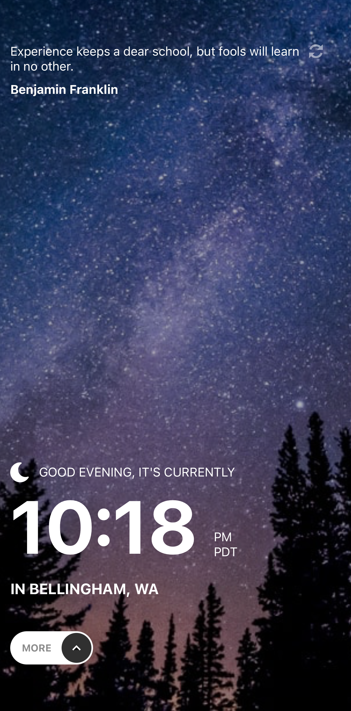
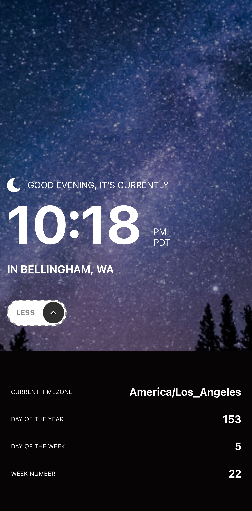

# Clock App
A simple Clock application simulated on an iPhone 14 Pro Max developed as part of a Mobile Application Development Course through Western Washington University.

   

<!-- TABLE OF CONTENTS -->

  
Table of Contents

  <ol>
    <li><a href="#Code-Base">Code Base</a></li>
    <li><a href="#Application">Application</a></li>
    <ul>
        <li><a href="#Functionality">Functionality</a></li>
        <li><a href="#Design">Design</a></li>
    </ul>
    <li><a href="#Thank-You">Thank You!</a></li>
  </ol>

## Code Base

Instead of starting from scratch, a code base has been generated for this application. The code base was revised by Professor Qiang Hao at Western Washington University from some code generated by ChatGPT.

## Application
Developed a simple Clock Application using React Native and Expo. Below is the simulated Clock application (dark/evening theme) on an iPhone 14 Pro Max:

### Functionality

Users are able to:

* View the current time and location information based on their IP address
* View additional information about the date and time in the expanded state
* Be shown the correct greeting and background image based on the time of day they're visiting the site
* Generate random programming quotes by clicking the refresh icon near the quote

Specifically, functionality that has been developed includes:

* Changing the greeting depending on the time of day. It should say:
  - "Good morning" between 5am and 12pm
  - "Good afternoon" between 12pm and 6pm
  - "Good evening" between 6pm and 5am
* Changing the greeting icon and background image depending on the time of day. They should show:
  - The sun icon and the daytime background image in the AM
  - The moon icon and the nighttime background image in the PM
* Generate a new random programming quote whenever the refresh icon is clicked

The following APIs have been used to retrieve the necessary data:

* World Time API (http://worldtimeapi.org/) to set the time based on the visitor's IP address. This API is also be used for additional data, like the day of the year shown in the expanded state.
* IP Geolocation API (https://ip-api.com/) to set the city and country underneath the time.
* Quotes API (https://api.quotable.io/random) to generate random programming quotes.

Lastly, test cases have been developed to test application rendering.

### Design

See the expected design in [the design folder](./design/).

## Thank You!
Enjoy this Clock application!